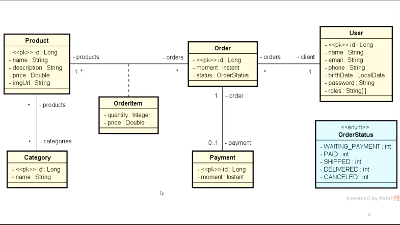
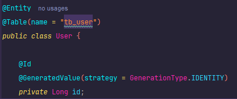
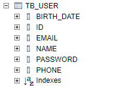
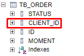
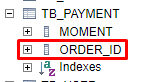

<p align="center">
  
</p>

# Objetivo

Interpretar o diagrama UML abaixo e implementar no Spring + Java, fazendo seu seed da base dados. Ou seja, dar uma carga
inicial com alguns dados.

## Requisitos projeto

Todas as premissas e e o sumário com o que deve ser feito está no "Documento de Requesitos DSCommerce.pdf". 
Como é algo específico do curso, não colocarei o link, mas você pode adquirir no site [devsuperior]().

## UML



## Criação de classes, qual criar primeiro vendo a UML?

A ideia é sempre começar por uma entidade independente. Para detectar isso, olhamos no diagrama as entidades que estão
nas pontas, como User, Payment. Mas no outro lado dela (no relacionamento), tem que estar o "muitos", não pode ter "um".

Por exemplo, no "User", na sua linha de relacionamento, do outro lado é um "muitos", ou seja, o User é independente,
pode ser iniciado sem colocar o pedido.

Outra entidade válida para ser iniciado primeiro, poderia também ser a "Category".

## Configuração banco H2, entidade User

Em application.properties:
```properties
spring.application.name=aula
spring.profiles.active=test
spring.jpa.open-in-view=false
```

Em application-test.properties, configurando banco H2:
```properties
spring.application.name=aula

# Dados de conexão com o banco H2
spring.datasource.driverClassName=org.h2.Driver
spring.datasource.url=jdbc:h2:mem:testdb
spring.datasource.username=sa
spring.datasource.password=
# Configuração do cliente web do banco H2
spring.h2.console.enabled=true
spring.h2.console.path=/h2-console
# JPA, SQL
spring.jpa.database-platform=org.hibernate.dialect.H2Dialect
spring.jpa.defer-datasource-initialization=true

# Configuração para mostrar o SQL no console
spring.jpa.show-sql=true
spring.jpa.properties.hibernate.format_sql=true
```

No nosso projeto, teremos vários perfis, seja: de teste, homologação, produção (nuvem). Mas enquanto estivermos
desenvolvendo e testando, o perfil será de teste, então, usaremos o banco H2.

## Mapeamento

Para que a nossa classe User apareça no nosso banco relacional, precisamos mapeá-la.



Assim, ao rodarmos a nossa Application, o Spring gerará a table e através da url "localhost:8080/h2-console", será
possivel checar nossa tabela tb_user.

Depois, só conectar no banco H2 com a URL do properties + user.

Tabela user criada:



## Order, Enum, relacionamento muitos-para-um

### Relacionamento muitos-para-um

Um pedido para um usuário. Um usuário, pode ter vários pedidos.

Classe Order:
```java
    @ManyToOne
    @JoinColumn(name = "client_id")
    private User client;
```

Como são várias Orders, será uma lista na classe User.

Classe User:
```java
    @OneToMany(mappedBy = "client")
    private List<Order> orders = new ArrayList<>();
```

Ao rodar o projeto com as anotações inseridas, dentro do H2, teremos uma nova coluna e tabela, veja:



Tabela Order criada, juntamente com a coluna "client_id", conforme passamos em sua classe.

❗Recomendação

No nosso atributo Instant, passar na coluna uma definição, para que ele seja salvo no banco de dados como um instante
padronizado em UTC (fuso horário de Londres, GMT), veja:
```java
    @Column(columnDefinition = "TIMESTAMP WITHOUT TIME ZONE")
    private Instant moment;
```

Assim, já saberemos que essa coluna é do tipo UTC. Será mais fácil depois converter para o horario local do usuário.

## Payment, relacionamento um-para-um

O pedido tem um pagamento. O pagamento está associado com um pedido. **(Payment depende do Order)**, pois para ele 
existir, precisa ter **AO MENOS, 1 PEDIDO**.

Além disso, o pedido pode existir sem pagamento (o minimo é zero pedidos).

Na entidade pagamento:
```java
    @OneToOne
    @MapsId
    private Order order;
```

Na entidade Order:
```java
    @OneToOne(mappedBy = "order", cascade = CascadeType.ALL)
    private Payment payment;
```

Ao rodarmos a nossa aplicação, no banco H2 veremos:

A table payment criada:



❗A coluna order_id existe, pois quando fizemos o mapeamento de um para um, fizemos a anotação @MapsId. Isso significa
que, a chave primária do payment, também será uma chave estrangeira com o MESMO número do pedido correspondente.

**Exemplo: Se tiver um pedido de número 5, o payment do pedido número 5, terá como id: 5!**

## Muitos-para-muitos, column unique e text

Aqui, relacionaremos Product e Category. 

Um produto pode ter muitas categorias. Uma categoria pode ter vários produtos.

Como a Category está na extremidade, ela não depende de Product.

Para indicarmos pro JPA que não terá qualquer tipo de repetição de category_id e product_id, utilizamos Set ao invés de
List.

Na entidade Product:
```java
    @ManyToMany
    @JoinTable(name = "tb_product_category",
            joinColumns = @JoinColumn(name = "product_id"),
            inverseJoinColumns = @JoinColumn(name = "category_id")
    )
    private Set<Category> categories = new HashSet<>();
```

O JoinTable criará uma tabela do meio, auxiliar ou de associação. Nela, passamos a referência para as duas chaves 
estrangeiras. 

Passamos o JoinClumns para o product_id e o InverseJoinColumns (do outro lado), a category_id.

❗O JoinColumn leva o nome da classe que estamos utilizando. Como é a Classe Product, é product_id.
<hr>

Na entidade Category:
```java
    @ManyToMany(mappedBy = "categories")
    private Set<Product> products = new HashSet<>();
```

Aqui é somente o mapeamento de como essa entidade (Category), foi mapeada na outra classe (Product).

Além disso, iremos ao JPA que a coluna "description", será uma coluna com vários caracteres. Usaremos o @Column, 
passando:
```java
    @Column(columnDefinition = "TEXT")
    private String description;
```

Assim, o JPA entende que ali será um texto longo, e não um varchar.

Por fim, configuraremos outros campos unicos, como email, por exemplo.
```java
    @Column(unique = true)
    private String email;
```


<hr>
Spring JPA - Subframework que auxilia a implementar acesso a dado a banco de dado relacional.